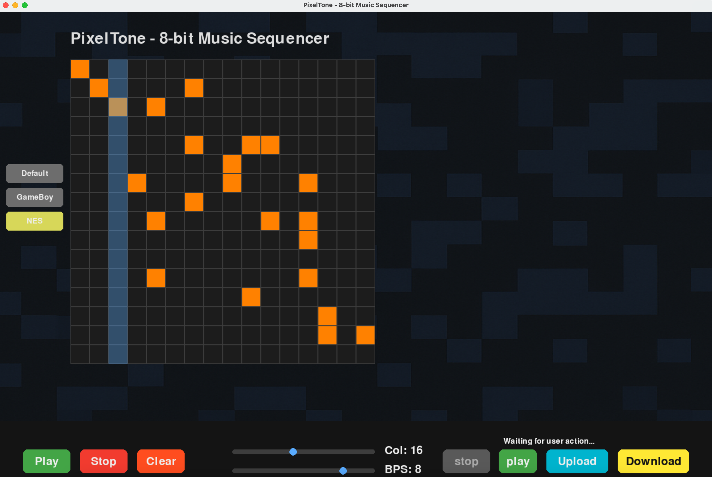

# 🎵 PixelTone: 8-Bit Music Sequencer

**PixelTone** is a retro-style 8-bit music sequencer built with Python, Pygame, and SciPy. It allows users to compose simple tunes on a pixel grid and convert uploaded `.mid` (MIDI) files into 8-bit style audio with customizable sound styles like NES and GameBoy.



---

## ✨ Features

- 🎚️ Interactive Grid-based Sequencer (16 rows × customizable columns)
- 🎮 Sound Style Options: NES, GameBoy, Default Square
- 🎼 Real-time playback and visualization
- 🎹 Upload MIDI files and convert to retro 8-bit audio
- 💾 Export generated audio as `.wav`
- 🖱️ GUI built with Pygame + Tkinter file browser

---

## 🛠️ Installation

```bash
git clone https://github.com/ShaunLovesU/8_bit_converter.git
cd 8_bit_converter
pip install -r requirements.txt
```

---

## ▶️ Usage

Simply run the main application:

```bash
python Try_project.py
```

You can:
- Draw notes on the grid and play them.
- Adjust tempo (BPS) and column count with sliders.
- Upload `.mid` files and convert them to 8-bit audio.

---

## 📁 File Structure

- `Try_project.py` – Main GUI app
- `blackboard.py` – MIDI parsing and audio synthesis module
- `requirements.txt` – Dependencies
- `background.png` – Optional background image for aesthetics

---

## 🎹 Sound Engine

The sound synthesis uses:
- Square waves
- Triangle waves
- White noise
- ADSR envelope control

It simulates the vibe of retro consoles like NES and GameBoy using procedural audio.

---

## 📦 Dependencies

- `pygame`
- `mido`
- `numpy`
- `scipy`
- `soundfile`
- `sounddevice`

Install via:

```bash
pip install -r requirements.txt
```

---

